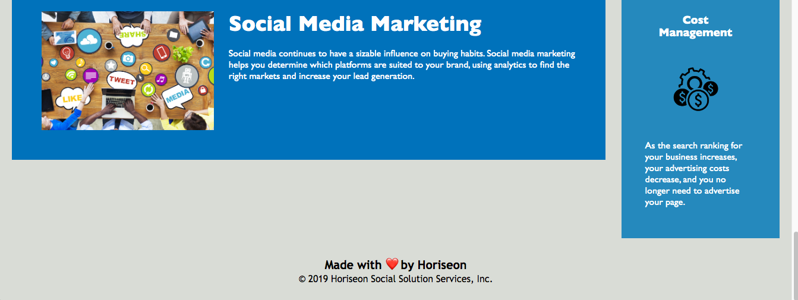

# <span style="color:green">Optimizing an SEO Website</span>

## Client Request
The Horiseon SEO/marketing agency stated
"I want a codebase that follows accessibility standards
so that our own site is optimized for search engines."

#### **Current Website**

## Website Review
After reviewing the Horiseon website html and css I discovered.
1) The html needed semantics to replace the repetitive divs.
2) Over used selectors in the css.
3) The images did not have attribute tags to help optimize searches.
4) There lacks any meta tags in the head to gain search results.
5) This website was designed with float which is outdated and difficult to work with style in css.
6) No comments in the html. 
7) Broken relative links.
8) Not responsive
9) Set up for desktop viewing not mobile


## Contribution/Solution
**Applied Corrections**
- Change semantics from div tags to header, footers, nav, sections, aside.
- Changed css appropriately without changing layout or content
- Corrected the link at the header to link into the intra-document areas to bring user to search-engine-optimization online-reputation-management social-media-marketing
- Corrected the hero id to become a class .background and moved the background image out of css and into the html document rather the css, and adjusted it
- Added a seo tag in meta in the head
- Changed to view ports

## Checked off line items requested
 - [x] Semantic HTML elements
 - [x] When viewing HTML elements its logical independent of styling and positioning
 - [x] Semantic HTML elements
 - [x] All image elements have an alt attribute
 - [x] All headings are sequential on order
 - [x] The title element is descriptive to the Horiseon website
 - [x] Added 20 px of padding-top the aside element
See screen shot below for area addressed <span style="color:red">**before**</span>screenshot:


<span style="color:red">**After**</span>:


```
/* Needed to add 20px at padding top on the aside */

aside {
    margin-right: 20px;
    
    /* padding: 20px; this elongated the aside element bottom padding to remain uneven with adjacent elements, see before picture*/
    
    padding-top: 20px;
    clear: both;
    float: right;
    width: 20%;
    height: 100%;
    font-family: 'Gill Sans', 'Gill Sans MT', Calibri, 'Trebuchet MS', sans-serif;
    background-color: #2589bd;
}
```
## Unchecked items
 - [ ] Responsive
 - [ ] Mobile first
 - [ ] Further meta tags in head needed to front load the seo
 - [ ] Flexbox update
 - [ ] Lacks forms 
 - [ ] Backend is not set up


The link to the deployed website is below:

[Horiseon Deployed](https://devil0341.github.io/opt-seo/)